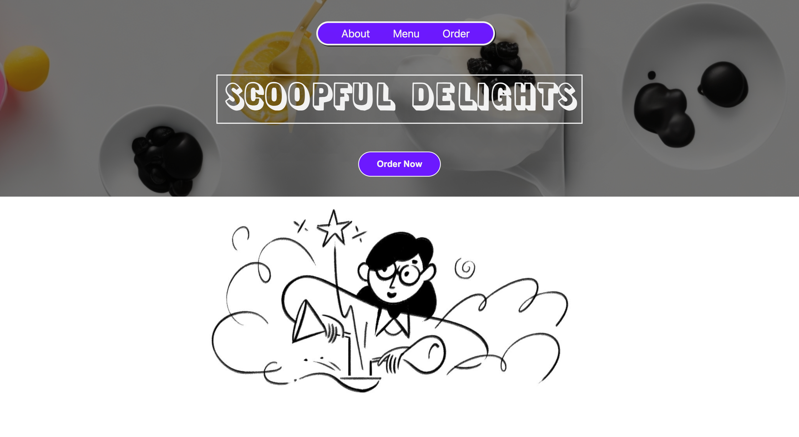

# Scoopful Delights 🍦

Welcome to Scoopful Delights, a delightful ice cream website built with Node.js and Express! 🎉

## Table of Contents

- [Introduction](#introduction)
- [Technologies Used](#technologies-used)
- [Installation](#installation)
- [Usage](#usage)
- [Contributing](#contributing)
- [License](#license)

## Introduction

Scoopful Delights is a static ice cream website that showcases a wide range of delicious ice cream flavors. 🍨 Enjoy browsing through our mouth-watering collection and get a glimpse of the delightful world of ice cream.

## Technologies Used

- Node.js
- Express
- HTML
- CSS
- JavaScript

## Installation

To view Scoopful Delights locally, follow these steps:

1. Clone this repository: `git clone <repository_url>`
2. Navigate to the project directory: `cd Scoopful-Delights`
3. Start a local server (e.g., using the Live Server extension in Visual Studio Code) or simply open `index.html` in your preferred browser.

## Usage

Once you have the application running or the website opened in your browser, you can:

- Browse through the available ice cream flavors.
- Read about each flavor's description and ingredients.
- Enjoy the visually appealing images of the ice creams. 📷
- Get inspired by the store branding and design.

Feel free to explore the website and get immersed in the world of ice cream! 🌍

## Contributing

We appreciate your interest in contributing to Scoopful Delights. Although this is a static website, you can still contribute by:

- Adding new ice cream flavors to the existing collection.
- Enhancing the website's design or user experience.
- Fixing any issues or bugs you come across.

To contribute, please follow these steps:

1. Fork the repository.
2. Create a new branch: `git checkout -b feature/your-feature`
3. Make your changes and commit them: `git commit -m 'Add your feature'`
4. Push the changes to your branch: `git push origin feature/your-feature`
5. Open a pull request to the main repository's `develop` branch.

We value your contributions and will review them as soon as possible! 🙌

## License

This project is licensed under the [MIT License](LICENSE). Feel free to modify and use the code for your own purposes. 📝

---